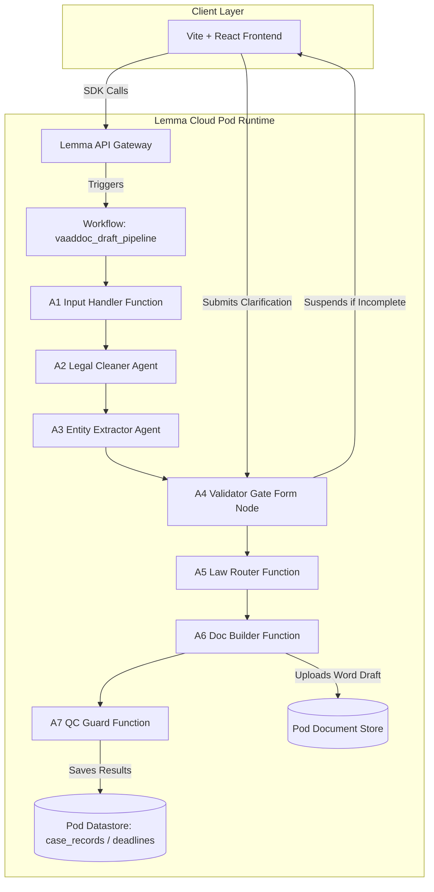

# VaadDoc — Premium AI Litigation Drafting & Statutory Router for Indian Lawyers

VaadDoc is a production-grade AI-powered litigation drafting copilot designed natively for Indian advocates. Built on top of the serverless **Lemma Cloud** agent and workflow runtime, it automates the compilation of raw intake notes, client statements, or legal transcripts directly into structured, court-ready legal drafts.

---

## 🌟 Key Features

1. **7-Agent Cloud-Native Pipeline:** Fully automated workflow carrying inputs through:
   - **A1 Input Handler:** Standardizes raw texts, normalizes Unicode encoding, and checks input validation criteria.
   - **A2 Legal Cleaner:** Automatically scrubs conversational transcripts, structures statements, and handles Hinglish conversions.
   - **A3 Entity Extractor:** Maps litigation parameters (plaintiff, defendant, relief sought, dates) with verbatim source text citations.
   - **A4 Validator Gate (Human-in-the-Loop):** Suspends execution if key required variables are missing, rendering an interactive clarification form to the lawyer, and resumes state on submit.
   - **A5 Law Router:** Dynamically routes sections to either **BNS/BNSS** or **IPC/CrPC** depending on the offence date (interpreting the July 1, 2024 transition boundary).
   - **A6 Document Builder:** Compiles high-fidelity Microsoft Word templates using `docxtpl` jinja rendering.
   - **A7 QC Guard:** Double-checks source grounding using fuzzy string matching and generates final confidence scores.
2. **Statutory Deadlines Dashboard:** Displays dynamic limitation period boundaries (Limitation Act 1963 Article 113, NI Act Section 138 notice windows, BNSS default bail windows) with severity highlight tags.
3. **BNS / IPC Law Router Lookup:** A standalone utility to instantly map corresponding statutory sections before and after the July 1, 2024 transition.
4. **Floating Procedural Assistant:** Chatbot widget offering advocates immediate, context-aware answers to Indian statutory queries.

---

## 🏗️ System Architecture

Unlike traditional monolithic server layouts, VaadDoc runs **100% serverless on Lemma Cloud**:



---

## 📁 Repository Structure

```text
├── frontend/               # React 18, Vite 8, React Router Dom, TailwindCSS
│   ├── src/pages/          # Page views (IntakePage, ProgressPage, ResultPage, DeadlinesPage, LawRouterPage)
│   ├── src/lib/lemma.ts    # Lemma JS Client Integration (Session & Workspace handling)
│   └── package.json        # Frontend Dependencies
│
├── backend-pod/            # Serverless Lemma Pod Bundle (syncs natively to Lemma Cloud)
│   ├── pod.json            # Pod metadata & runtime configs
│   ├── tables/             # Datastore tables (sessions, case_records, deadlines)
│   ├── agents/             # LLM Agent definitions (legal_cleaner, entity_extractor)
│   ├── functions/          # Python function executors (handle_input, validate_entities, build_document, run_qc)
│   └── workflows/          # State machine graph routing (vaaddoc_draft_pipeline)
│
├── TESTING.md              # E2E test cases, input logs, and verification guide
├── DEMO.md                 # Demo video timeline, AI clips guide, and storyboard
└── .gitignore              # Project-level git ignore rules
```

---

## 🚀 Setup & Deployment Guide

This project is deployed to Lemma Cloud. To replicate or deploy changes:

### 1. Prerequisite Installations
*   **Node.js**: v18 or higher (for the frontend client)
*   **Python**: v3.10 or higher
*   **Lemma CLI**: Install via pip:
    ```bash
    pip install lemma-cli
    ```

### 2. Synching the Backend Pod Bundle
1.  Authenticate the CLI with your Lemma server account:
    ```bash
    lemma auth login
    ```
2.  Create the destination folder structures inside your pod files store:
    ```bash
    lemma files mkdir /generated
    lemma files mkdir /templates
    lemma files mkdir /inputs
    ```
3.  Deploy the database tables, agents, python functions, and workflow schema:
    ```bash
    lemma pod import ./backend-pod --pod vaaddoc-pod
    ```

### 3. Deploying the Frontend App
1.  Navigate to the `frontend/` directory:
    ```bash
    cd frontend
    ```
2.  Install packages:
    ```bash
    npm install
    ```
3.  Compile the React project:
    ```bash
    npm run build
    ```
4.  Publish the static bundle directly to the Lemma Cloud App host:
    ```bash
    lemma apps deploy vaaddoc-frontend --dist-dir dist --pod vaaddoc-pod -y
    ```
    *Live Application served at*: `https://vaaddoc-frontend.apps.lemma.work`

---

## ⚖️ Technology Stack

*   **Core Logic**: JavaScript (ES6+), Python 3.10+
*   **UI Components**: Vite 8, React 18, React Router Dom, TailwindCSS, Lucide React icons
*   **Word Rendering**: `python-docx`, `docxtpl`
*   **AI Routing**: Gemini models routed dynamically by Lemma Cloud Orchestrator
